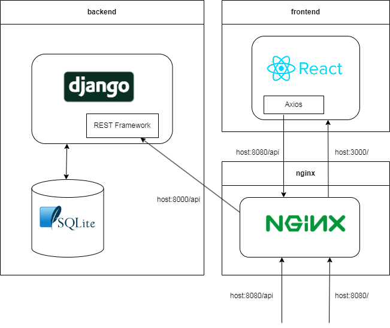

Django Quiz Manager - quiz data storage application with embedded quiz-player on ReactJS. 


## About

This is repository for the QuizManager application.
Main idea of the project is that for simple binary relation:
```
 { 
   "Q1" : "answer_1",
   "Q2" : "answer_2",
   "Q3" : "answer_3", 
   ...
 } 
```
reasonable quiz can be generated by picking right answer and some random subset of alternatives.

Many quizzes behave in this way, including such important examples like word quizzes, alphabet and kanji tests. From the list of questions and right answers stored in database in .json format this simple app can construct the quizzes.

Not to mention that this project can be used for educational purposes or as a template for typical Django/React web-application.

## Build with Docker and Nginx
Before you start make sure you have Docker installed (tested on version 20.10.17).
Then configure global .env file (see .env.global.example) which is linked in docker-compose.yml and in parent project folder run
```
docker-compose build
docker-compose up
```
The app should be running in [localhost:8080](http://localhost:8080)
and API should be available on [localhost:8080/api/quizzes/{quiz_id}](http://localhost:8080/api/quizzes)



For manual build and development check out documentation in /backend/README.md

## Advanced [work in progress]
As a first step to production security level you can equip Nginx with self-signed SSL certificate.
After that the connection between your server and user should become more secure (still nobody will trust you, cause its self-signed).

First generate .pem, .crt and .key files following
[instructions](https://www.digitalocean.com/community/tutorials/how-to-create-a-self-signed-ssl-certificate-for-nginx-on-centos-7).
```
cd nginx
sudo openssl req -x509 -nodes -days 365 -newkey rsa:2048 -keyout nginx-selfsigned.key -out nginx-selfsigned.crt
sudo openssl dhparam -out ./dhparam.pem 2048
```
To enable HTTPS use Dockerfile_SSL for nginx (docker-compose.yml):
```
  nginx:
    ...
    build:
      context: ./nginx
      dockerfile: Dockerfile_SSL
```
And in .env file change value of REACT_APP_API_SERVER
```
REACT_APP_API_SERVER=https://localhost:443
```
And then you can set up project as usual (sudo may be necessary for copying .key files).

## Acknowledgements
Backend is revised version of this [tutorial](https://github.com/techiediaries/django-react)
on digital ocean. And frontend is based on my previous project [JSQuiz](https://github.com/mihael-tunik/JSQuiz).
Also big thanks to this [template](https://github.com/Ceci-Aguilera/django-react-nginx-mysql-docker).
