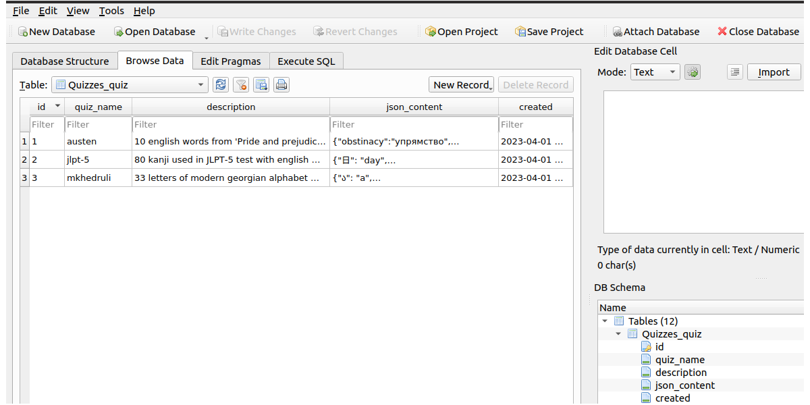

## About
This is repository for the QuizManager application.
Main idea of the project is that most of the quizzes are based on simple binary relation:
```
 { 
   A : B,
   C : D,
   E : F, 
   ...
 } 
```
Then reasonable quiz can be generated by picking right answer and some random subset of alternatives
```
 {
   A? : {B, F},
   C? : {B, D},
   E? : {D, F},
   ...
 }
```
Many quizzes behave in this way, including such important examples like
- Word quizzes;
- Alphabet and kanji tests;
- Math tests.

From the list of questions and right answers in .json format this simple app can construct the quizzes.

## Usage
Run Django API on localhost (it is a good practice to put Django SECRET_KEY value in .env file):
```
nano .env
python3 manage.py runserver
```
You can use default db.sqlite3 file



or you also may need to migrate first if you want to use your own database:
```
rm db.sqlite3
python3 manage.py migrate
```
- Then open ./frontend folder and run:
```
npm start
```

Congratulations, the app should be running in [localhost:3000](http://localhost:3000) 

## Requirements
Python >= 3.7 (see requirements.txt);
NodeJS >= 18.14.2;

## Acknowledgements
Backend is revised version of this [tutorial](https://github.com/techiediaries/django-react)
on digital ocean. And frontend is based on my previous project [JSQuiz](https://github.com/mihael-tunik/JSQuiz).
