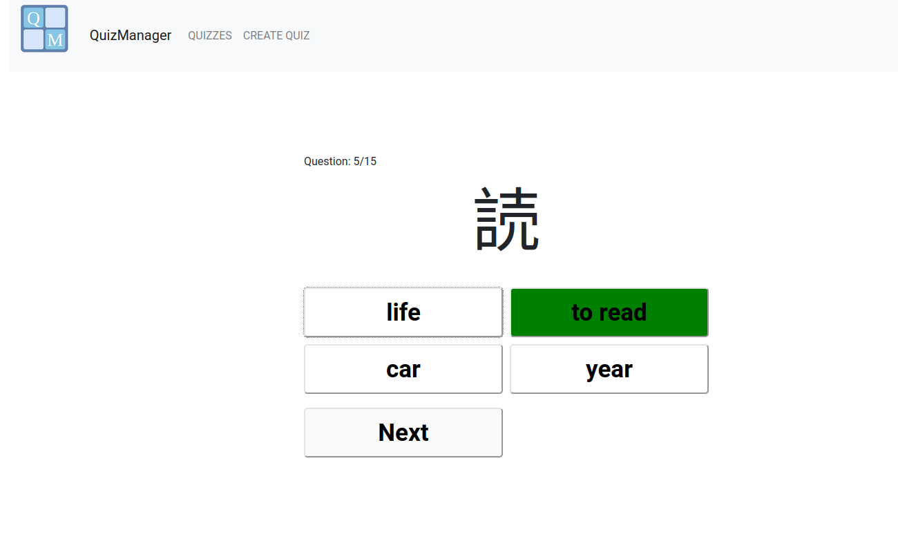

## Project structure
The main folders are /backend, /frontend and /nginx.
They are containing source code and/or configure files necessary for building independent docker containers.
At the same time project can be set up without Docker and the way you can do it is described below.

## Technology stack
Django/REST Framework for backend and React.js for frontend part.
And Nginx is used as reverse-proxy because this project is serious business :)

## Requirements
Python >= 3.8.10;
NodeJS >= 18.14.2;

## Manual build
- Backend application can be set up as follows. First install dependensies:
```
pip3 install -r requirements.txt
```
You can use default db.sqlite3 file


or you also may need to migrate first if you want to delete default and use your own database:
```
python3 manage.py migrate
```
- Then open ./react_frontend folder and install dependencies:
```
npm install
```
Do not forget that this time Nginx is not used, so in local .env file port 8000 should be used 
```
REACT_APP_API_SERVER=http://localhost:8000
```

## Run
New version use authentication via JWT, so you need to create user before run:
```
python3 manage.py createsuperuser
```
and after you can finally run Django API on localhost (don't forget to put Django SECRET_KEY value in your local .env file):
```
python3 manage.py runserver
```
or you also can use gunicorn
```
gunicorn QuizManager.wsgi:application --bind 127.0.0.1:8000
```
Then simply run:
```
cd frontend/react_frontend
npm start
```

Congratulations, the app should be running in [localhost:3000](http://localhost:3000)
and API should be available on [localhost:8000/api/quizzes](http://localhost:8000/api/quizzes)
